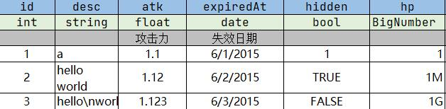

# 简介
导出 Excel 到各种结构化数据或代码。除命令行接口外也提供了
 Python API 便于做二次加工。


# 繁介
你总会需要一些由非技术人员提供的数据来充实你的产品内容，比如美术资源和游戏数值。美术资源好说，
规范好目录和文件名就万事大吉了，但数值咋放呢？必须要有一个他懂、你懂、程序也懂的数值载体。
Excel 作为一款数据处理工具，做游戏数值简直易如反掌。于是本项目应运而生，用来搬运 Excel 数据。

 p.s: 避免人工编辑 json, xml, 数据库之类的，那样太低效，很没人情味。


# 特性
 - 支持类型约束
    - 基本类型:  
      string, int, float, bool
    - 数组类型:  
      文法：array\<类型\>  
      例子：array\<int\>, array\<float\>, array\<bool\> 等等
    - Map 类型:  
      键值对数据, 就是 hash table  
      文法：map\<类型, 类型\>  
      例子：map\<string, string\>, map\<string, int\> 等等
    - Object 类型:  
      用于自定义字段名和字段类型  
      文法：Object\<字段1:类型, 字段2：类型, ...\> 字段名和类型可自由定义多个  
      例子：Object\<id:int, name\>  表示将 `{9527, “小明”}` 导出为 `{“id”:9527, "name":"小明"}`
    - ItemExpr(物品表达式)  
      一种易于读写的 DSL, 用于描述游戏中的资源数值。  
      文法: 类型-ID-数量.  
      例子: coin-100 表示 100 金币.  weapon-1001-4 表示 4件ID为1001的武器。
    - Ratio 类型： 表示数字比例  
      例子： 1:100

 - 支持多种数据结构 e.g. list,dict, （tree 还有待探索）。
 - 支持导出到 json, msgpack.
 - 支持导出到任意代码(需要使用 mako 模板脚本)。


# 运行依赖

  * Python3.6+

# 安装
```
$ pip install excel2xx
```

# 使用

## Excel 数据表 



## Python API示例（推荐）

* 读取 excel sheet
    ```python
    from excel2xx import Excel
    excel = Excel("abc.xlsx")

    # 获取第一个 sheet
    sheet = excel[0]
    for row in sheet:
        print(row)
        
    # 根据 sheet 名获取
    sheet = excel["你好啊"]
    for row in sheet:
        print(row)
    ```
* 自定义 ItemExpr(游戏资源类型)
    ```python
    from excel2xx import Excel
    from excel2xx.fields import ItemExpr

    # 注册一个只包含 count 字段的资源类型
    ItemExpr.register("coin", ItemExpr.OnlyCount)

    # 注册自定义的资源类型
    def parse_youritem(v:str) -> dict:
        # parsing...
        return blahblah...
    ItemExpr.register("your item", parse_youritem)
    excel = Excel("abc.xlsx")
    ...
    ```


## CLI 示例（即将作废）
```
$ excel2xx json example/test.xls    -o example/test.json
$ excel2xx msgpack example/test.xls -o example/test.msgpack
$ excel2xx mako example/test.xls    -o example/test.lua  --template example/test.lua.mako
```

## TODO
 * [x] 支持导出到任意编程语言代码(用 mako 模板引擎).
 * [ ] 支持自定义数据检错过程，用于杜绝过于低级的数值错误.

# LICENSE
<a href="https://www.wtfpl.net/">
    
</a>

```text
            DO WHAT THE FUCK YOU WANT TO PUBLIC LICENSE
                    Version 2, December 2004

 Copyright (C) 2014-2023 cupen<xcupen@gmail.com>

 Everyone is permitted to copy and distribute verbatim or modified
 copies of this license document, and changing it is allowed as long
 as the name is changed.

            DO WHAT THE FUCK YOU WANT TO PUBLIC LICENSE
   TERMS AND CONDITIONS FOR COPYING, DISTRIBUTION AND MODIFICATION

  0. You just DO WHAT THE FUCK YOU WANT TO.
```
